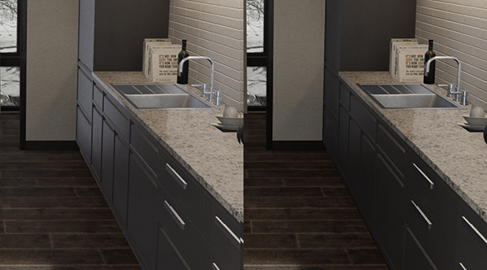
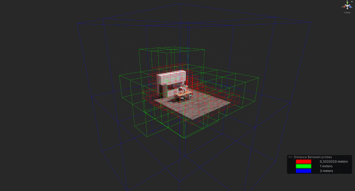

# Understand Probe Volumes

A Probe Volume is a group of [Light Probes](https://docs.unity3d.com/Manual/LightProbes.html) Unity places automatically based on the geometry density in your Scene, to create baked indirect lighting. Using Probe Volumes means you don't need to spend time manually placing and configuring Light Probes.

## Advantages and limitations

| **Feature** | **Original Light Probes** | **Probe Volumes** |
|---|---|---|
| Selection of surrounding probes | Per object | Per pixel |
| Optimize memory use with streaming | No | Yes |
| Place probes automatically | No | Yes  |
| Blend between different bakes | No | Yes |
| Place probes manually |  Yes  | No |

Probe Volumes have the following advantages:

- Unity selects surrounding probes per-pixel rather than per-object, which means HDRP lights objects more accurately.
- If you use [volumetric fog](Local-Volumetric-Fog.md), the per-pixel probe selection provides more accurate lighting for the variations in a fog mass.
- You can adjust Light Probe layouts across a Scene, for example using a denser set of Light Probes in an interior area with more detailed lighting or geometry. See [Display and adjust Probe Volumes](probevolumes-showandadjust.md) for more information.
- Probe Volumes work well with multiple scenes simultaneously. See [Baking Sets](probevolumes-concept.md#baking-sets)
- Because Probe Volumes can cover a whole scene, screen space effects can fall back to Light Probes to get lighting data from objects that are off-screen or occluded. See [Screen Space Global Illumination](Override-Screen-Space-GI.md) for more information.
- Unity can use the data in Probe Volumes to adjust lighting from Reflection Probes to match the local environment, which reduces the number of Reflection Probes you need. See [Frame Settings properties](Frame-Settings.md#cameralighting).
- Probe Volumes include [streaming](probevolumes-streaming.md) functionality to support large open worlds.

 
The left scene uses original Light Probes, where the per-object lighting means each part of the car is uniformly lit and the lighting does not transition well from light to dark. The right scene uses Probe Volumes. This image uses the ArchVizPRO Photostudio HDRP asset from the Unity Asset Store.

 
In the left scene, Reflection Probe Normalization is disabled. In the right scene, Reflection Probe Normalization is enabled, and there's less specular light leaking on the kitchen cabinet. This image uses the ArchVizPRO Interior Vol.5 HDRP asset from the Unity Asset Store.

Probe Volumes have the following limitations:

- You can't adjust the locations of Light Probes inside a Probe Volume. You can use settings and overrides to try to fix visible artifacts, but it might not be possible to make sure Light Probes follow walls or are at the boundary between different lighting areas. See [Fix issues with Probe Volumes](probevolumes-fixissues.md) for more information.
- You can't convert [original Light Probes](https://docs.unity3d.com/Manual/LightProbes.html) into a Probe Volume.

## How Probe Volumes work

When you add a Probe Volume to a Scene, HDRP automatically distributes rectangular groups ('bricks') of Light Probes inside the volume.

### Brick size and Light Probe density

HDRP structures a brick in the following way:

- A brick contains 64 Light Probes, arranged in a 4 × 4 × 4 grid.
- By default, the distance between the Light Probes is 1, 3, 9 or 27 meters.

Because the number of Light Probes in a brick is always the same, the larger the distance between the probes, the larger the brick.

### How HDRP distributes bricks

In areas of your Scene with more geometry, HDRP uses bricks with a short distance between Light Probes. The short distance means Light probes are closer together, and lighting data is higher resolution.

In areas with less geometry, HDRP uses bricks with a large distance between Light Probes. The large distance means Light Probes are farther apart, and lighting data is lower resolution.

You can use the Rendering Debugger to visualize and configure the layout of bricks and Light Probes. See [Display and adjust Probe Volumes](probevolumes-showandadjust.md).

 
In this screenshot from the Rendering Debugger, the small red bricks contain Light Probes spaced 0.3 meters apart, to capture data from high-geometry areas. The large blue bricks contain Light Probes spaced 3 meters apart, to capture data from areas with less geometry. This image uses the ArchVizPRO Interior Vol.8 HDRP asset from the Unity Asset Store.

Each pixel of an object samples lighting data from the eight closest Light Probes around it. See [Add a Volume to your Scene](probevolumes-fixissues.md#volume) for more information on adjusting which Light Probes objects sample.

## Baking sets

Each Scene that uses Probe Volumes must be part of a Baking Set.
A Baking Set contains the following:

- One or more Scenes, which optionally include Probe Volumes.
- A single set of settings.

By default, HDRP will use **Single Scene** mode, and place each scene in its own Baking Set automatically. However, only one Baking Set can be active at any time, so if you [work with multiple scenes](https://docs.unity3d.com/Manual/MultiSceneEditing.html), you must add any scenes you'll load to the same Baking Set and bake them all altogether.

You can only add each scene to a single Baking Set.

HDRP will use the settings from the Baking Set when baking the lighting, and serialize the result on disk for runtime usage. Additionally, HDRP supports Lighting Scenarios, which means you can bake several variations of the lighting data for a Baking Set and switch between them at runtime.

See [Use Baking Sets](probevolumes-use.md#use-baking-sets).

## Additional resources

* [Light Probes](https://docs.unity3d.com/Manual/LightProbes.html)
* [Local Volumetric Fog](Local-Volumetric-Fog.md)
* [Work with multiple Scenes in Unity](https://docs.unity3d.com/Documentation/Manual/MultiSceneEditing.html)
